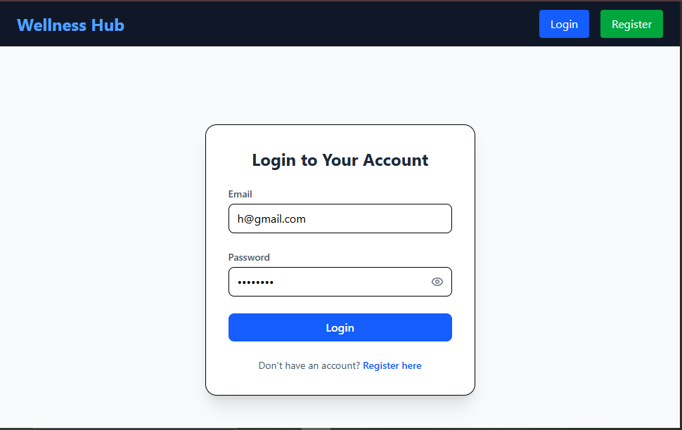
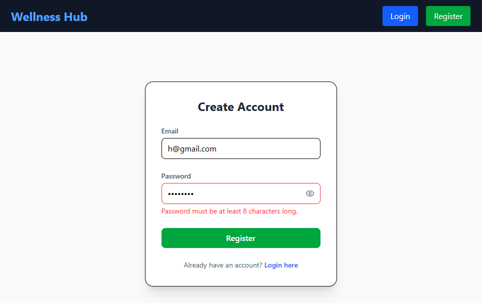
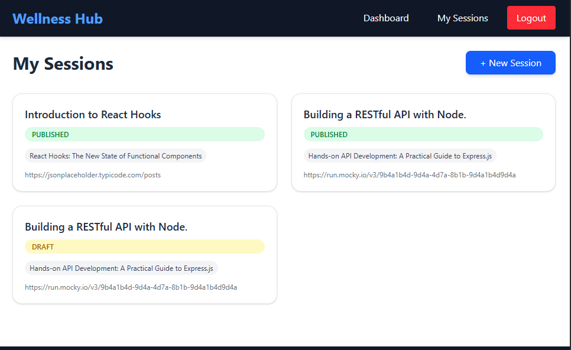
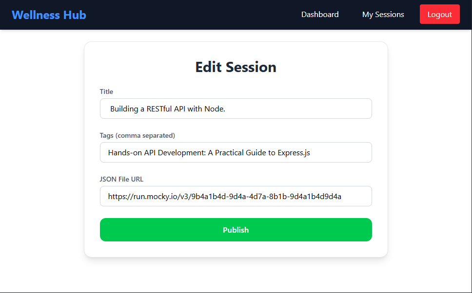

# Wellness Hub

A full-stack web application for creating, managing, and publishing sessions with JSON files. Built with **React**, **Node.js**, **Express**, and **MongoDB**.

---

## 🔗 Links

- [GitHub Repository](https://github.com/sharmaHarshit2000/arvyax-wellness-hub)
- [Live Demo(Frontend)](https://arvyax-wellness-hub.vercel.app)
- [Backend](https://arvyax-wellness-hub.onrender.com)
- [Video Walkthrough (Loom)](https://www.loom.com/share/d6272242108746aea058dd552f4dd5a0)

---

## 📂 Folder Structure

### Backend (`/backend`)
```
/backend
├─ controllers/
│   ├─ authController.js
│   └─ sessionController.js
├─ middlewares/
│   └─ authMiddleware.js
├─ models/
│   ├─ User.js
│   └─ Session.js
├─ routes/
│   ├─ authRoutes.js
│   └─ sessionRoutes.js
├─ server.js
├─ .env
└─ package.json
```

### Frontend (`/frontend`)
```
/frontend
├─ src/
│   ├─ pages/
│   │   ├─ Login.jsx
│   │   ├─ Register.jsx
│   │   ├─ Dashboard.jsx
│   │   ├─ MySessions.jsx
│   │   └─ SessionEditor.jsx
│   ├─ components/
│   │   ├─ Navbar.jsx
│   │   ├─ Footer.jsx
│   │   ├─ Toast.jsx
│   │   ├─ Loader.jsx
│   │   └─ NotFound.jsx
│   ├─ api/
│   │   └─ api.js
│   ├─ context/
│   │   └─ AuthContext.jsx
│   ├─ hooks/
│   │   └─ useAuth.js
│   ├─ routes/
│   │   └─ PrivateRoute.jsx
│   ├─ utils/
│   │   └─ debounce.js
│   ├─ App.jsx
│   └─ index.js
├─ package.json
└─ .env
```

---

## ⚙️ Setup Instructions

### 1. Clone the repository
```bash
git clone https://github.com/sharmaHarshit2000/arvyax-wellness-hub.git
cd arvyax-wellness-hub
```

### 2. Backend Setup
```bash
cd backend
npm install
cp .env.example .env  # Set your environment variables
npm run dev           # Start backend server
```

### 3. Frontend Setup
```bash
cd frontend
npm install
cp .env.example .env  # Set your environment variables if needed
npm run dev           # Start frontend server
```

### 4. Access
- Frontend: [http://localhost:5173](http://localhost:5173) (or your configured port)
- Backend API: [http://localhost:5000](http://localhost:5000) (or your configured port)

---

## 📝 Environment Variables

**Backend (.env):**
```
PORT=5000
MONGO_URI=your_mongo_connection_string
JWT_SECRET=your_jwt_secret_key
```

**Frontend (.env):**
```
VITE_API_URL=http://localhost:5000
```

---

## 📦 API Routes

### Auth
| Method | Route         | Description                |
|--------|--------------|---------------------------|
| POST   | /auth/register | Register new user         |
| POST   | /auth/login    | Login user                |
| GET    | /auth/me       | Get current logged-in user|

### Sessions
| Method | Route                              | Description                   |
|--------|------------------------------------|-------------------------------|
| GET    | /sessions                          | Get all published sessions    |
| GET    | /sessions/my-sessions              | Get sessions created by user  |
| GET    | /sessions/my-sessions/:id          | Get a single session by ID    |
| POST   | /sessions/my-sessions/save-draft   | Save or update draft session  |
| POST   | /sessions/my-sessions/publish      | Publish a session             |

---

## 👨‍💻 Features

- User authentication (Login/Register)
- Create, edit, and publish sessions
- Tag management
- JSON file attachment and validation
- Responsive UI for mobile and desktop
- Live saving draft functionality

---

## 🎨 Frontend

- React + Tailwind CSS
- Responsive design
- Lazy-loaded pages for better performance
- Toast notifications for actions
- Loader for async operations

## ⚡ Backend

- Node.js + Express
- MongoDB (Mongoose)
- JWT authentication
- RESTful API routes

---

## 📸 Screenshots

### 🔐 Authentication
| Login Page | Register Page |
|------------|---------------|
|  |  |

### 🏠 Dashboard


### ✍️ Session Editor


### 📅 Published Sessions


---


## 📝 Notes

- Ensure MongoDB is running locally or use a cloud instance.
- Update `.env` with your credentials before running the app.
- Frontend and backend are separate; make sure API URLs match `.env` config.
